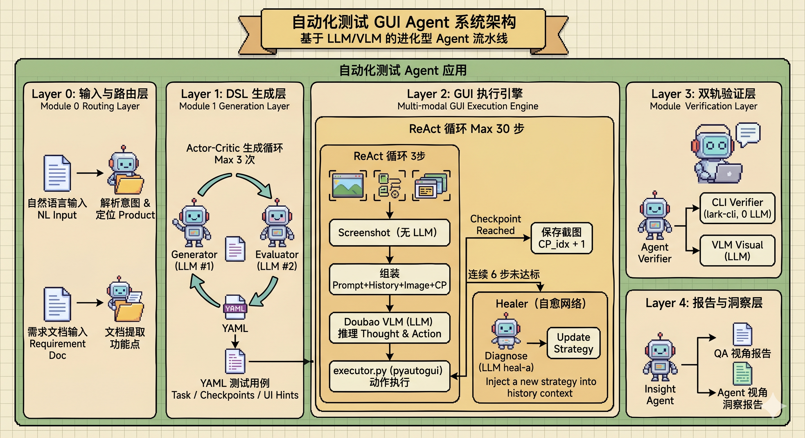

# Lark-CUA

> 飞书桌面端 GUI 自动化测试 Agent — 飞书 AI 产品创新赛道 · CUA-Lark 课题 · 第 6 组

用多模态大模型（豆包 2.0 Vision）像真实用户一样看着屏幕操作飞书，完成自动化功能测试，无需元素选择器。

全流程：**自然语言 → DSL 用例生成 → GUI 自动执行 → 双层验证 → 双份 AI 报告 → 发布飞书文档**

---

## 系统架构



---

## 功能概览

| 模块 | 能力 |
|------|------|
| **DSL 生成** | 自然语言 → YAML 测试用例（含 ui_hints、cli_verifications、checkpoints） |
| **文档驱动生成** | 读取飞书云文档 → 自动提取可测功能点 → 批量生成 DSL 用例 |
| **DSL 评分** | 6 维度 0/1/2 打分（UI 准确性、可执行性、可验证性、难度、完整性、检查点质量） |
| **GUI Agent** | ReAct 循环：截图 → 豆包 Vision → 解析坐标 → pyautogui 执行 + 检查点追踪 |
| **自愈模块** | checkpoint 超时时自动诊断失败原因，注入新策略让 Agent 调整路径继续推进 |
| **记忆模块** | 自愈成功后将问题/解决/启发写入 `memory/<product>.md`，供后续任务参考 |
| **双层验证** | CLI（lark-cli 结构化查询）+ VLM（截图断言），支持时间过滤防重复 |
| **AI 测试报告** | 从测试工程师视角：飞书功能是否正常？发现了哪些 Bug？ |
| **AI Agent 分析** | 从 Agent 视角：执行质量、瓶颈步骤、ui_hints 改进建议 |
| **飞书云文档** | MD 归档 + 飞书文档（每步截图 + 两份 AI 分析） |
| **Benchmark** | 按产品/等级/标签/ID 过滤，截图按 run/case/step 分层保存 |

---

## 项目结构

```
Lark-Agent/
├── config.py                   # 全局配置，从 .env 加载
├── requirements.txt
├── run_pipeline.py             # 一键全流程入口
│
├── agent/
│   ├── loop.py                 # ReAct 主循环，每步保存截图 + VLM 日志
│   ├── executor.py             # 解析 + 执行 pyautogui（DPI 自动处理）
│   ├── healer.py               # 自愈模块：触发检测、诊断、memory 条目生成
│   ├── verifier.py             # 双层验证：CLI + VLM，支持时间过滤
│   ├── prompts.py              # 飞书专用 system prompt
│   └── screenshot.py           # 全屏截图（mss）
│
├── llm/
│   ├── doubao_client.py        # 豆包 ARK API 封装
│   └── feishu_api.py           # 飞书开放平台 API（token 管理、DocX、Drive）
│
├── tools/
│   ├── dsl_generator.py        # shim → dsl/generator.py
│   ├── dsl_evaluator.py        # shim → dsl/evaluator.py
│   ├── doc_case_generator.py   # 飞书云文档 → 批量 DSL 用例生成
│   └── report_publisher.py     # 生成 MD 报告 + 发布飞书云文档
│
├── report/
│   ├── md.py                   # Markdown 报告渲染（含步骤锚点）
│   ├── feishu_doc.py           # 飞书云文档发布（步骤配图 + AI 分析）
│   └── insight_agent.py        # 豆包 AI 分析与改进建议生成
│
├── tests/
│   ├── run_benchmark.py        # Benchmark 批量运行入口
│   ├── benchmark/              # 官方测试用例 YAML（im/docs/calendar/...）
│   │   └── generated/          # DSL 生成的测试用例存放目录
│   └── results/                # benchmark 结果 JSON
│
├── screenshots/
│   └── run_{ts}/               # 每次运行一个文件夹
│       └── {case_id}_{title}/  # 每个用例一个子文件夹
│           ├── step01_{action}.png
│           ├── step01_vlm.txt  # 对应步骤的 VLM 原始输出
│           └── ...
│
├── memory/                     # 自愈经验记忆（每个产品一个 .md 文件）
├── reports/                    # 生成的 MD 报告
├── docs/
│   ├── self_healing.md         # 自愈与记忆模块设计文档
│   ├── ui_context/             # 各产品 UI 布局文档（供 DSL 生成使用）
│   │   └── im.md
│   └── design.md
└── ui_tars/                    # ByteDance UI-TARS action parser（Apache-2.0）
```

---

## 快速开始

### 1. 安装依赖

```bash
cd Lark-Agent
pip install -r requirements.txt
npm install -g @larksuite/lark-cli   # 飞书 CLI，用于验证和报告发布
```

### 2. 配置 .env

在 `Lark-Agent/` 目录下创建 `.env`（已加入 .gitignore）：

```env
# 豆包 API（火山引擎 ARK 控制台获取）
EP-ID = ep-xxxxxxxxxxxxxxxx-xxxxx
DOUBAO-API-KEY = ark-xxxxxxxxxxxxxxxxxxxxxxxxxxxxxxxx

# 飞书开放平台（open.feishu.cn/app）
FEISHU_APP_ID = cli_xxxxxxxxxxxxxxxx
FEISHU_APP_SECRET = xxxxxxxxxxxxxxxxxxxxxxxxxxxxxxxx
FEISHU_REPORT_FOLDER = xxxxxxxxxxxxxxxxxxxxxxxx   # 报告文件夹 token
FEISHU_HOST = https://<your-tenant>.feishu.cn
```

> **FEISHU_REPORT_FOLDER**：打开飞书云文档目标文件夹，URL 中 `/folder/` 后面那段即为 token。

### 3. 登录飞书 CLI

```bash
lark-cli auth login   # 浏览器授权，一次即可
```

### 4. 验证环境

```bash
python tests/test_api.py
```

---

## 一键全流程

### 流程 A：单任务

```bash
python run_pipeline.py --task "打开与张三的单聊，发送「测试消息 Hello」" \
                       --product im \
                       --contact "张三" \
                       --publish
```

加上自愈与记忆：

```bash
python run_pipeline.py --task "打开与张三的单聊，发送「测试消息 Hello」" \
                       --product im \
                       --contact "张三" \
                       --heal --use-memory \
                       --publish
```

### 流程 B：文档驱动（从飞书云文档批量生成并运行）

```bash
python run_pipeline.py --from-doc "https://xxx.feishu.cn/docx/..." \
                       --product im \
                       --contact "张三" \
                       --levels L1,L2 \
                       --max-cases 5 \
                       --heal --use-memory \
                       --publish
```

流程 B 会自动完成：读取文档 → 提取功能点 → 批量生成 DSL → GUI 执行 → 报告发布。

参数说明：

| 参数 | 说明 | 默认 |
|------|------|------|
| `--task` | 自然语言任务描述（流程 A，与 `--from-doc` 二选一）| — |
| `--from-doc` | 飞书云文档 URL 或 token（流程 B，与 `--task` 二选一）| — |
| `--product` | 飞书产品线 `im/docs/calendar/base/vc/mail` | `im` |
| `--contact` | 替换 `<<TEST_CONTACT>>` 占位符 | 必填 |
| `--group` | 替换 `<<TEST_GROUP>>` 占位符 | 可选 |
| `--levels` | 生成用例的难度等级，逗号分隔（流程 B）| `L1,L2` |
| `--max-cases` | 最多生成几个用例（流程 B）| `10` |
| `--publish` | 完成后发布飞书云文档报告 | 关闭 |
| `--no-insights` | 跳过 AI 分析（报告更快）| 关闭 |
| `--skip-eval` | 跳过 DSL 质量评分 | 关闭 |
| `--delay` | GUI 操作前等待秒数（切换到飞书窗口）| `5` |

---

## 各模块单独使用

### DSL 生成

从自然语言生成 YAML 测试用例：

```bash
# 生成 DSL（存入 tests/benchmark/generated/im/）
python tools/dsl_generator.py --product im "在飞书 IM 中向张三发送消息「Hello」"

# 生成并立即评分
python tools/dsl_generator.py --product im --evaluate "..."
```

输出示例：`tests/benchmark/generated/im/IM_GEN_003.yaml`

---

### 文档驱动用例生成

读取飞书云文档，自动提取可测功能点并批量生成 DSL 用例：

```bash
# 基本用法
python tools/doc_case_generator.py \
    --doc "https://xxx.feishu.cn/docx/..." \
    --product im

# 指定等级和上限
python tools/doc_case_generator.py \
    --doc "https://xxx.feishu.cn/docx/..." \
    --product docs \
    --levels L1,L2 \
    --max-cases 5

# 跳过评分循环（更快，质量略低）
python tools/doc_case_generator.py \
    --doc "https://xxx.feishu.cn/docx/..." \
    --product im \
    --no-evaluate
```

流程说明：
1. 通过 `lark-cli docs +fetch` 读取文档 Markdown 内容
2. 按 `##` 标题分段，每段调豆包提取"可测操作功能点"列表
3. 按等级过滤后，每个功能点调 `generate_loop()` 生成并评分精炼
4. 生成的用例保存至 `tests/benchmark/generated/<product>/`

| 参数 | 说明 | 默认 |
|------|------|------|
| `--doc` | 飞书文档 URL 或 token | 必填 |
| `--product` | 目标产品线 | 必填 |
| `--levels` | 难度等级过滤，逗号分隔 | `L1,L2` |
| `--max-cases` | 最多生成几个用例 | `10` |
| `--no-evaluate` | 跳过生成→评分精炼循环 | 关闭 |

---

### DSL 评分

对已有的 YAML 用例进行质量评分：

```bash
python tools/dsl_evaluator.py tests/benchmark/generated/im/IM_GEN_003.yaml

# 保存评分结果为 .eval.json
python tools/dsl_evaluator.py tests/benchmark/generated/im/IM_GEN_003.yaml --save
```

评分维度（各 0/1/2 分）：

| 维度 | 说明 |
|------|------|
| `ui_accuracy` | UI 路径与真实界面一致性 |
| `executability` | 步骤是否可直接执行 |
| `verifiability` | 成功标准能否从截图判断 |
| `difficulty` | 难度定级与步骤数是否匹配 |
| `completeness` | 所有字段是否填写完整 |
| `checkpoint_quality` | Checkpoint 是否为路径无关的必经状态节点 |

---

### Benchmark 运行

```bash
# 运行所有 IM 用例
python tests/run_benchmark.py --product im --contact "张三"

# 只跑生成的用例，指定等级
python tests/run_benchmark.py --product im --level L2 --contact "张三"

# 跑指定 case ID
python tests/run_benchmark.py --case-id IM_GEN_003 --contact "张三"

# Dry run（只打印任务，不操作屏幕）
python tests/run_benchmark.py --product im --dry-run
```

运行结果保存至 `tests/results/benchmark_{ts}.json`，截图保存至 `screenshots/run_{ts}/`。

---

### 自愈模块

Agent 在执行过程中遇到 checkpoint 长时间未完成时，自动触发自愈：调用 VLM 分析失败原因，将诊断结论和新策略注入对话上下文，让 Agent 在已有历史截图的基础上自行调整路径继续推进。

自愈期间完成目标 checkpoint 后，自动生成一条经验记录（问题 / 解决 / 启发）写入 `memory/<product>.md`，供后续类似任务参考。

```bash
# 启用自愈
python tests/run_benchmark.py --case-id DOC_L2_006 --contact 张三 --heal

# 启用自愈 + 读取历史经验
python tests/run_benchmark.py --case-id DOC_L2_006 --contact 张三 --heal --use-memory
```

| 参数 | 说明 | 默认 |
|------|------|------|
| `--heal` | 启用自愈模块 | 关闭 |
| `--heal-max N` | 每个用例最多自愈次数 | `2` |
| `--heal-no-patch` | 自愈后不写 memory 文件 | 写入 |
| `--use-memory` | 运行前将 memory 文件注入任务上下文 | 关闭 |

当前已实现触发类型：`CHECKPOINT_TIMEOUT`（checkpoint 6 步内未到达）。详见 `docs/self_healing.md`。

---

### 生成报告

```bash
# 仅生成 Markdown 报告
python tools/report_publisher.py tests/results/benchmark_XXXXXX.json

# 生成 MD + 发布飞书云文档（含每步截图 + AI 分析）
python tools/report_publisher.py tests/results/benchmark_XXXXXX.json --publish

# 跳过 AI 分析（速度更快）
python tools/report_publisher.py tests/results/benchmark_XXXXXX.json --publish --no-insights

# 发布到指定文件夹
python tools/report_publisher.py tests/results/benchmark_XXXXXX.json --publish --folder <folder_token>
```

飞书云文档结构：
- 执行摘要（TSR、平均步骤、耗时）
- 每个用例：操作轨迹（步骤文本 + 对应截图）→ 验证结果 → AI 测试报告 → AI Agent 分析

---

### 单步任务（不走 Benchmark）

```bash
python tests/test_loop.py "在飞书日历中创建明天下午 3 点的会议"
```

---

## 截图与日志结构

每次 benchmark 运行后：

```
screenshots/
└── run_20260430_215828/
    └── IM_GEN_002_搜索联系人发测试消息/
        ├── step01_hotkey.png    # 截图（按操作类型命名）
        ├── step01_vlm.txt       # 豆包原始 Thought+Action 输出
        ├── step02_type.png
        ├── step02_vlm.txt
        └── ...
```

---

## 验证机制

执行完成后自动触发双层验证：

**CLI 层**（lark-cli 结构化查询，地面真值）
- `im_message`：搜索消息关键词，过滤测试开始时间后的记录（防止历史消息误判）
- `calendar_event`：查询近 7 天日程
- `drive_doc`：搜索云文档标题
- `im_chat`：查询群聊是否存在

**VLM 层**（截图断言）
- 每条 checkpoint 对应其执行步骤的截图（不全用最终截图）
- 占位符 `<<TEST_CONTACT>>` 等在发送给 VLM 前自动替换

---

## 配置参考

`config.py` 中的可调参数：

| 参数 | 说明 | 默认 |
|------|------|------|
| `MAX_STEPS` | 单次任务最大步骤数 | `30` |
| `STEP_WAIT_MS` | 执行操作后等待 UI 渲染的时间（ms）| `1500` |
| `HISTORY_TURNS` | 保留的历史对话轮数 | `6` |

---

## VM 模式（OSWorld 风格隔离评测）

VM 模式将执行环境迁移到 VMware 虚拟机，每次测试前还原快照保证环境干净。

```env
VM_MODE=true
VM_SERVER_URL=http://<VM的IP>:8765
```

```bash
python tests/vm_runner.py \
  --vmx "C:\path\to\vm.vmx" \
  --snapshot base \
  --product im \
  --reset each     # each=每个case还原 | once=每次run还原
```

详细配置见原 [VM 模式文档](#vm-模式-osworld-风格隔离评测-1)。

---

## 里程碑进度

| 阶段 | 内容 | 状态 |
|------|------|------|
| M1 | 截图→豆包→解析→执行闭环，单步操作验证 | ✅ 完成 |
| M2 | 多轮对话历史管理，IM/Calendar/Drive E2E | ✅ 完成 |
| M3 | 自然语言→DSL 生成 + 5 维评分 | ✅ 完成 |
| M4 | CLI+VLM 双层验证 + Benchmark 框架 | ✅ 完成 |
| M5 | 双份 AI 报告（测试报告 + Agent 分析）+ 飞书云文档自动发布 | ✅ 完成 |
| M6 | 自愈式执行，基于飞书文档批量生成用例 | ✅ 完成 |

---

## 技术参考

- [UI-TARS（ByteDance）](https://github.com/bytedance/UI-TARS) — action_parser 来源，Apache-2.0
- [火山引擎 ARK 文档](https://www.volcengine.com/docs/82379) — 豆包 API
- [飞书开放平台](https://open.feishu.cn/document/) — lark-cli + DocX API
- [larksuite/lark-cli](https://github.com/larksuite/cli) — 飞书 CLI 工具

---

## License

Apache-2.0（`ui_tars/` 部分遵循 ByteDance 原始协议）
